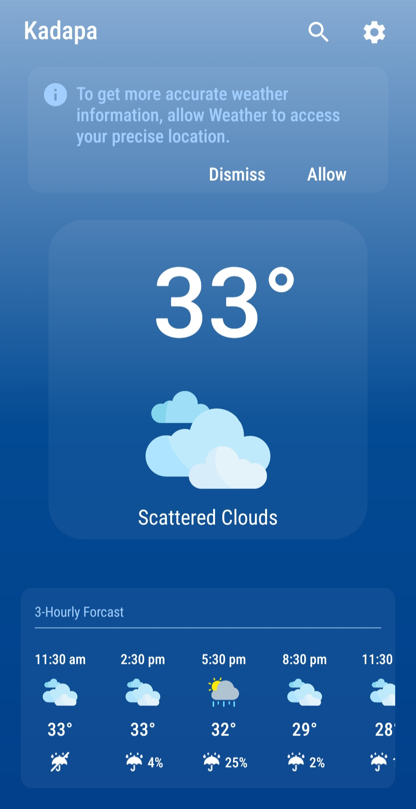
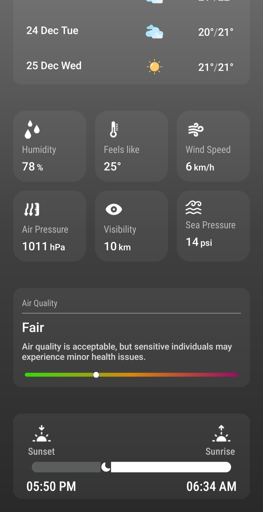
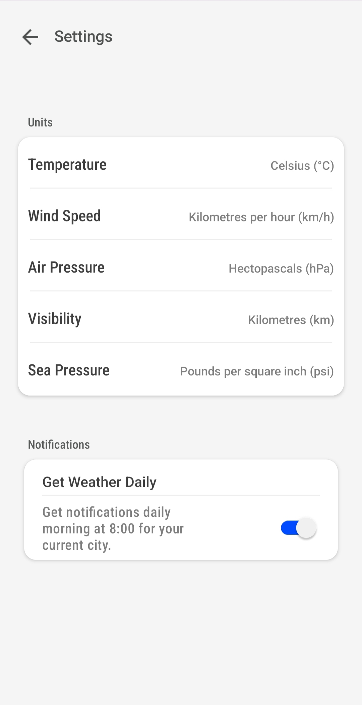
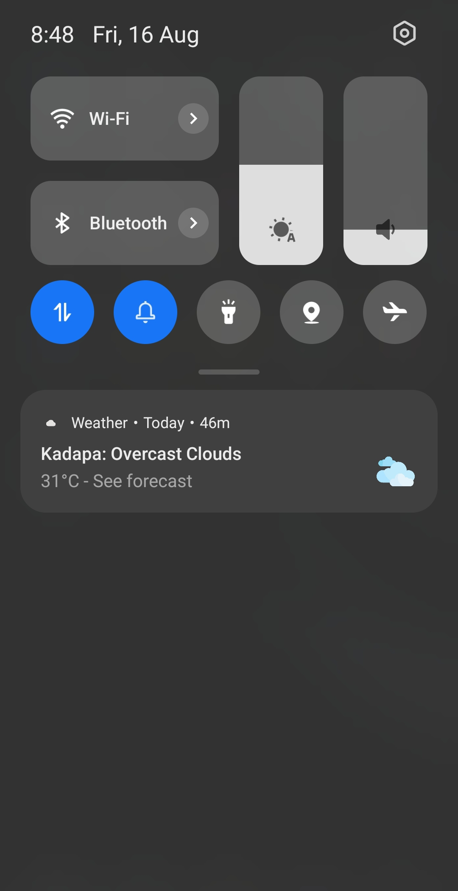

#  Weather App

A modern, lightweight, and responsive Android Weather App that delivers real-time weather updates through API integration. Built with Jetpack components and optimized for performance.

---

## 📲 Download APK

👉 **[Download Latest APK from GitHub Releases](https://github.com/MohammedKaif-3/Weather/releases/download/v1.0.0/weather.apk)**

Includes:

* `app-arm64-v8a-release.apk` (64-bit)
* `app-armeabi-v7a-release.apk` (32-bit)
* *(Optional)* `universal.apk` that supports all devices

---

## 📸 Screenshots
<div>
  
  
  
  
  
</div>


---

## 🌟 Features

* Real-time weather updates by city name
* Lottie animations for smooth weather visuals
* Pull-to-refresh functionality
* Responsive design across devices using SDP/SSP
* Firebase push notifications
* Material Design components and smooth navigation
* Multi-device support: 64-bit & 32-bit APKs
* Jetpack Navigation for screen transitions
* Unit conversion (Celsius ↔ Fahrenheit, km/h ↔ mph)
* Daily weather notifications
* Use current location for precise weather update

---

## 🧰 Built With

* **Volley** – for making network/API calls
* **Lottie** – for animated weather icons
* **Firebase Cloud Messaging** – for push notifications
* **Jetpack Navigation Component** – for handling fragment transitions
* **SwipeRefreshLayout** – for pull-to-refresh gesture
* **SDP / SSP Libraries** – for responsive UI scaling
* **Material Design Components** – for a modern UI experience

---

## ⚙️ Getting Started

1. Clone this repo:

   ```bash
   git clone https://github.com/MohammedKaif-3/Weather.git
   ```

2. Open the project in **Android Studio**

3. Run the app on a device or emulator.

---

## 🌐 Weather API

This app uses the **OpenWeatherMap API** for fetching real-time weather data.

🔗 [Visit OpenWeatherMap](https://openweathermap.org/api) to get your free API key and explore the documentation.

---

## 🚳️ Roadmap

Planned Features:

* ⛈️ Location-based weather updates
* 🗖️ 7-day weather forecast
* 🌘 Dark mode support
* 🌍 Multi-language localization
* 🚨 Severe weather alerts
* 📊 Air Quality Index (AQI) info

---

## 👨‍💻 Author

 **Mohammed Kaif**
* [Email](mailto:mohammedzaif61@gmail.com)
* [LinkedIn](https://www.linkedin.com/in/mohammedkaif003/)

---

## 📄 License

This project is licensed under the [MIT License](LICENSE).

---
